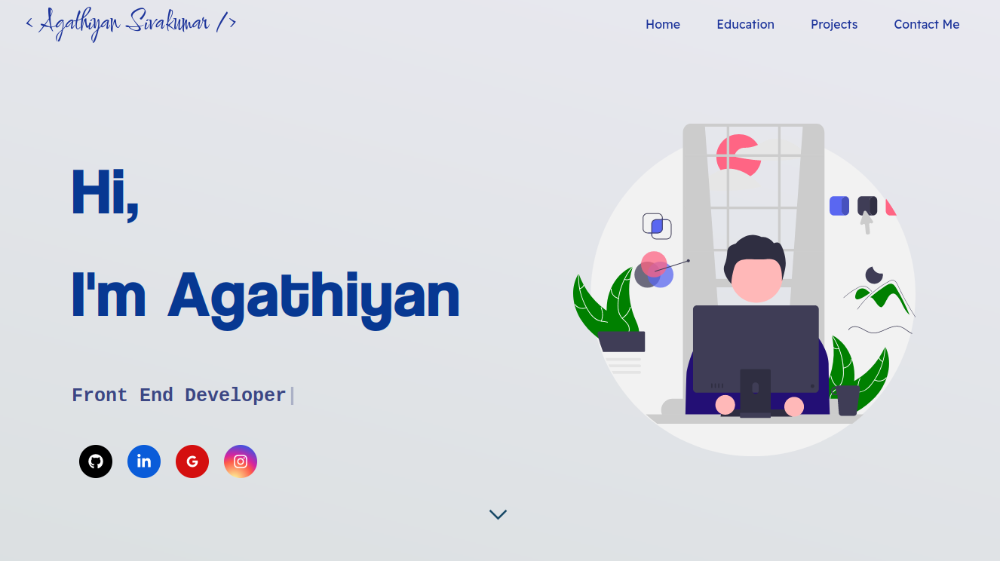

<h1 align="center"> Software Developer Portfolio 🔥 </h1> 
<h3 align="center"> A clean, beautiful, responsive and 100% customizable portfolio <br /> template for Software Developers! </h3>

<div align="center" >
  
  <a href="https://nodejs.org/en/blog/release/v12.13.0/"></a>
  <a href="https://www.npmjs.com/package/npm/v/6.13.4"></a>
  <a href="https://reactjs.org/"></a>
  <a href="https://github.com/prettier/prettier"></a>
  <br/>
  <a href="https://travis-ci.org/badges/badgerbadgerbadger"></a>
  <a href="http://badges.mit-license.org/"></a>
  <a href="https://github.com/ashutosh1919/masterPortfolio/commits/master"></a>
  <a href="https://img.shields.io/badge/price-free-ff69b4"></a>
</div>
<p align="center"> 
    <a href="https://agathiyans.web.app" target="_blank">
    </img>
  </a>
</p>

# Sections 📚

✔️ Summary and About me\
✔️ Skills \
✔️ Certifications 🏆\
✔️ Education\
✔️ Contact me

To view a live example, **[click here](https://agathiyans.web.app)**

# Clone And Use 📋

- The website is completely built on `react-js` library of `javascript` and that's why we need `nodejs` and `npm` installed.
- While installing `nodejs` and `npm`, try to install versions which are equal or greater than the versions mentioned in badges above.
- In case you want to help developing it or simply saving it, you can fork the repository just by clicking the button on the top-right corner of this page.
- After the successful installation of `nodejs` and `npm`, clone the repository into your local system using below command:
  - ```bash
     git clone https://github.com/agathiyans28/portfolio-app-reactjs.git
    ```
  - This will clone the whole repository in your system.
- To download required dependencies to your system, navigate to the directory where the cloned repository resides and execute following command:
  - ```node
    npm install
    ```
- Now, the project is ready to use.
- You can check it using `npm start`, it will open the website locally on your browser.

# Customize it to make your own portfolio ✏️

In this project, there are basically 4 things that you need to change to customize this to anyone else's portfolio: **package.json**, **Personal Information**, **Github Information** and **Splash Logo**.

### package.json

Open this file, which is in the main cloned directory, choose any "name" and change "homepage " to `https://<your-github-username>.github.io`. Do not forget the `https://`, otherwise fonts will not load.

### Personal Information

You will find `src/data.js` file which contains the complete information about the user. The file looks something like below:

```javascript
// Home Page
const greeting = {
    ...
}
// Social Media
const socialMedia = {
    ...
}
...
```

You can change the personal information, experience, education, social media, certifications, blog information, contact information etc. in `src/data.js` to directly reflect them in portfolio website.


## Other

 - You need to change the website title and other descriptions in `public/index.html`


# Deployment 📦

- Once you are done with your setup and have successfully completed all steps above, you need to put your website online!
- I highly recommend using [Github Pages](https://create-react-app.dev/docs/deployment/#github-pages) to achieve this the EASIEST WAY.
- To deploy your website, you have two options. First you need to create a github repository with the name `<your-github-username>.github.io`. Please don't give it any other name.
- Now, you need to generate a production build and deploy the website.

**Option 1:**

- Run `npm run build` to generate the production build folder.
- Enter the build folder, `git init` and push the generated code to the `master` branch of your new repository on github. That's it. It's Done.
- You may need to `git init` and force push at every new build.
**Option 2 (will not work with [user pages](https://docs.github.com/en/github/working-with-github-pages/about-github-pages)):**

- Run `npm run deploy` to build and create a branch called `gh-pages`. It will push the `build` files to that branch.
- The last step in deploying is to enable `Github Pages` in settings of the repository and select `gh-pages` branch.

Now, your website is successfully deployed and you can visit it at `<your-github-username>.github.io`.  


# illustrations 🍥

- [UnDraw](https://undraw.co/illustrations)

# License 📄

This project is licensed under the MIT License - see the [LICENSE.md](./LICENSE) file for details.


<!-- markdownlint-restore -->

# References 👏🏻

- Some Design and Implementation Ideas are taken from [Ashutosh Hathidara Portfolio Project](https://github.com/ashutosh1919/masterPortfolio).
